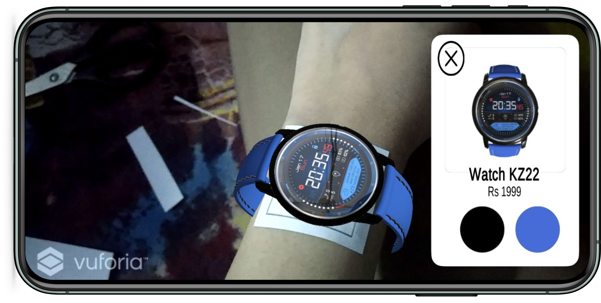
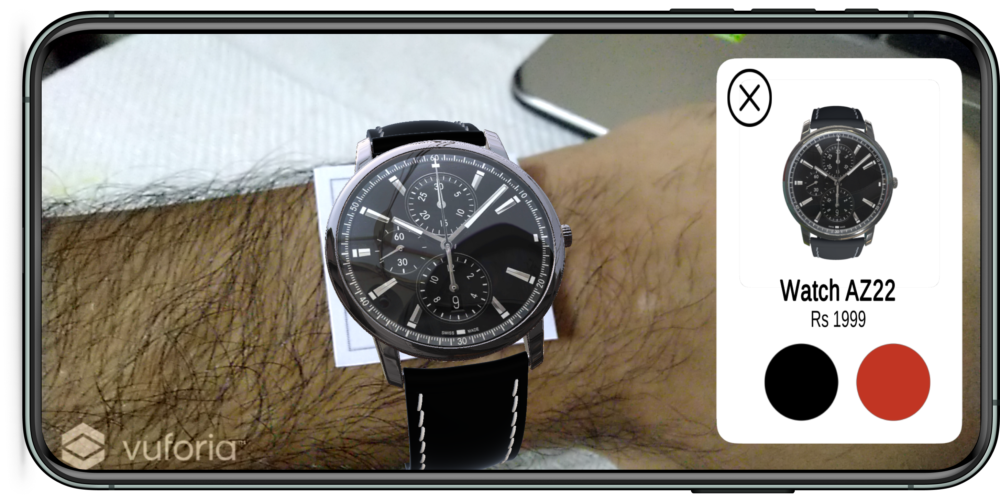
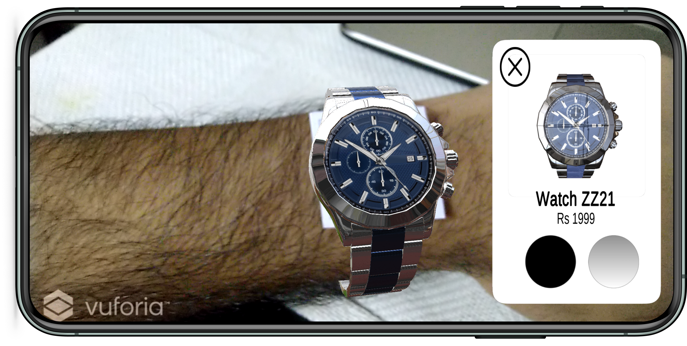

# Watchkart AI

<!-- 

  
  

 
  -->

Watchkart AI is an AR Try-On App which lets you try various watches real-time on your wrists. This very concept was used by Lenskart to show how frames would look on faces.

## This is how it looks ?

 
 
 

## Briefly, here is how you can try it out:

1. Download and install the [file](https://appsenjoy.com/yekAp) on your **Android** device.
2. Download and print [this](images/target/target.pdf) target image.
3. Cut the target image out and place it over your wrist.
4. Scan the image in the app. This step will work even if you skip Step 2.

Download link to the app : https://appsenjoy.com/yekAp
